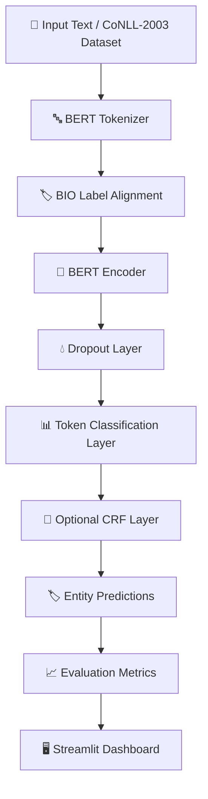

# 🧠 Named Entity Recognition System

### BERT-Based Named Entity Recognition for Text and Broadcast Analytics

An end-to-end **Named Entity Recognition (NER)** system built using **BERT**, designed to automatically identify and classify important entities from unstructured text.

The system is fine-tuned using the **CoNLL-2003 dataset** and uses the standard **BIO tagging scheme** for token classification. It can identify entities such as people, organizations, locations, and miscellaneous named entities.

The project also includes an interactive **Streamlit dashboard** that allows users to enter text and visualize extracted entities along with prediction confidence scores.

---

## 📌 The Problem

Large amounts of textual information are generated every day through news articles, broadcast transcripts, reports, social media, and other digital sources.

Manually identifying important entities such as:

* 👤 People
* 🏢 Organizations
* 📍 Locations
* 🏷️ Other named entities

from large volumes of text is time-consuming and inefficient.

Traditional rule-based approaches often struggle with contextual meaning. For example, the same word may represent different entities depending on the sentence.

This project addresses that challenge using a **Transformer-based BERT model**, which learns contextual relationships between words and performs token-level classification.

---

## 🚀 Features

* 🧠 **BERT-Based NER Model**
  Fine-tunes a pretrained `bert-base-uncased` model for token classification.

* 🏷️ **BIO Tagging Scheme**
  Uses the standard Begin-Inside-Outside encoding for entity recognition.

* 🔍 **Multiple Entity Classes**
  Detects:

  * Person (`PER`)
  * Organization (`ORG`)
  * Location (`LOC`)
  * Miscellaneous (`MISC`)

* 🔗 **Optional CRF Layer**
  Supports a Conditional Random Field layer to improve structured BIO sequence predictions.

* 📊 **Model Evaluation**
  Evaluates predictions using:

  * Precision
  * Recall
  * F1 Score

* ⚙️ **Configurable Training Pipeline**
  Centralized configuration for model parameters, training settings, datasets, checkpoints, and output directories.

* 🛑 **Early Stopping**
  Prevents unnecessary training when validation performance stops improving.

* 📈 **TensorBoard Logging**
  Supports training visualization and experiment monitoring.

* ⚡ **Mixed Precision Training**
  Supports Automatic Mixed Precision for faster GPU training.

* 🖥️ **Interactive Streamlit Dashboard**
  Provides a simple interface for entering text and visualizing detected entities.

* 🎯 **Confidence Scores**
  Displays prediction confidence for each detected entity.

---

# 🏗️ System Architecture



---

## 🔄 Model Pipeline

The system follows the following workflow:

```text
Input Text
     │
     ▼
BERT Tokenizer
     │
     ▼
Tokenized Input + Attention Mask
     │
     ▼
BERT Contextual Encoder
     │
     ▼
Dropout Regularization
     │
     ▼
Linear Classification Layer
     │
     ▼
Optional CRF Decoder
     │
     ▼
BIO Tag Predictions
     │
     ▼
Entity Extraction
     │
     ▼
Interactive Visualization
```

---

# 🏷️ Entity Classes

The model uses the standard BIO tagging format.

| Tag      | Description                         |
| -------- | ----------------------------------- |
| `O`      | Token is outside an entity          |
| `B-PER`  | Beginning of a Person entity        |
| `I-PER`  | Inside a Person entity              |
| `B-ORG`  | Beginning of an Organization entity |
| `I-ORG`  | Inside an Organization entity       |
| `B-LOC`  | Beginning of a Location entity      |
| `I-LOC`  | Inside a Location entity            |
| `B-MISC` | Beginning of a Miscellaneous entity |
| `I-MISC` | Inside a Miscellaneous entity       |

---

# 🧠 Model Architecture

The core architecture of the system is:

```text
Input Tokens
      │
      ▼
BERT Encoder
      │
      ▼
Contextual Token Embeddings
      │
      ▼
Dropout Layer
      │
      ▼
Linear Classification Layer
      │
      ▼
Optional CRF Layer
      │
      ▼
NER Tag Predictions
```

### Base Model

```text
bert-base-uncased
```

The BERT encoder generates contextual embeddings for every token in the input sequence.

These embeddings are then passed through:

1. Dropout layer for regularization
2. Linear classification layer
3. Optional CRF decoder for structured sequence prediction

---

# 📂 Project Structure

```text
Named-Entity-Recognition-System/
│
├── app.py
│   └── Streamlit web application for interactive NER inference
│
├── config.py
│   └── Central configuration for model, training, data and paths
│
├── train.py
│   └── Main training pipeline
│
├── resume_train.py
│   └── Resume training from saved checkpoints
│
├── predict.py
│   └── Run inference using the trained NER model
│
├── eval_test.py
│   └── Evaluate the trained model on test data
│
├── requirements.txt
│   └── Project dependencies
│
├── checkpoints/
│   └── Saved trained model checkpoints
│
├── runs/
│   └── TensorBoard training logs
│
└── output/
    └── Generated predictions and results
```

---

# 🛠️ Technologies Used

| Technology                | Purpose                           |
| ------------------------- | --------------------------------- |
| Python                    | Core programming language         |
| PyTorch                   | Deep learning framework           |
| Hugging Face Transformers | BERT model and NLP utilities      |
| Hugging Face Datasets     | Dataset loading and preprocessing |
| BERT                      | Contextual language model         |
| CRF                       | Structured sequence prediction    |
| SeqEval                   | Sequence labeling evaluation      |
| Scikit-learn              | Machine learning utilities        |
| TensorBoard               | Training visualization            |
| Streamlit                 | Interactive web interface         |

---

# ⚙️ Installation

## 1. Clone the Repository

```bash
git clone https://github.com/pritomsarma/Named-Entity-Recognition-System.git
```

Move into the project directory:

```bash
cd Named-Entity-Recognition-System
```

---

## 2. Create a Virtual Environment

### Windows

```bash
python -m venv venv
venv\Scripts\activate
```

### Linux / macOS

```bash
python3 -m venv venv
source venv/bin/activate
```

---

## 3. Install Dependencies

```bash
pip install -r requirements.txt
```

---

# 🚀 Training the Model

To train the model using the default configuration:

```bash
python train.py
```

The default training configuration includes settings such as:

* BERT-based encoder
* CoNLL-2003 dataset
* BIO tagging
* Token classification
* Dropout regularization
* AdamW optimization
* Learning rate warmup
* Early stopping
* TensorBoard logging
* Optional CRF decoding

Training parameters can also be adjusted according to the available hardware and experiment requirements.

---

# 🔄 Resume Training

If training is interrupted or you want to continue from a saved checkpoint:

```bash
python resume_train.py
```

This allows the training pipeline to continue using previously saved model checkpoints.

---

# 🔮 Running Predictions

After training the model, predictions can be generated using:

```bash
python predict.py
```

The trained model processes the input text and returns detected named entities along with their predicted categories.

---

# 📊 Model Evaluation

The system includes evaluation functionality for testing model performance.

Run:

```bash
python eval_test.py
```

The model is evaluated using standard Named Entity Recognition metrics:

### Precision

Measures how many predicted entities are correct.

```text
Precision = Correct Predicted Entities / Total Predicted Entities
```

### Recall

Measures how many actual entities were successfully identified.

```text
Recall = Correct Predicted Entities / Total Actual Entities
```

### F1 Score

Provides a balanced measure of precision and recall.

```text
F1 Score = 2 × (Precision × Recall) / (Precision + Recall)
```

---

# 🖥️ Running the Web Application

The project includes an interactive Streamlit dashboard.

Run:

```bash
streamlit run app.py
```

The application allows users to:

* Enter or paste text
* Analyze the text using the trained NER model
* Highlight detected entities
* View entity classifications
* View confidence scores
* See the total number of detected entities
* View average prediction confidence

---

# ✨ Example

### Input

```text
U.N. Secretary-General Kofi Annan visited Baghdad today.
```

### Possible Output

| Entity     | Classification |
| ---------- | -------------- |
| U.N.       | Organization   |
| Kofi Annan | Person         |
| Baghdad    | Location       |

The Streamlit interface also displays the entities directly inside the original text with visual highlighting.

---

# ⚙️ Configuration

All major system configurations are centralized inside:

```text
config.py
```

The configuration includes:

### 🧠 Model Configuration

* Pretrained BERT model
* Number of labels
* Hidden size
* Dropout rate
* Maximum sequence length
* CRF configuration

### 🚀 Training Configuration

* Learning rates
* Batch size
* Number of epochs
* Weight decay
* Gradient clipping
* Learning rate warmup
* Label smoothing
* Mixed precision training
* Early stopping

### 📊 Data Configuration

* Dataset subsets
* Training split size
* Validation split size
* Test split size
* Maximum sequence length

### 📁 Path Configuration

Automatically manages directories for:

```text
checkpoints/
runs/
output/
```

---

# 📈 Training Visualization

The project supports TensorBoard for monitoring the training process.

Run:

```bash
tensorboard --logdir runs
```

Then open the local TensorBoard URL displayed in your terminal.

Training metrics can be monitored to analyze:

* Training loss
* Validation performance
* Model convergence
* Experiment progress

---

# 🎯 Use Cases

This Named Entity Recognition system can be extended for applications such as:

* 📰 News and broadcast transcript analysis
* 📺 Media analytics
* 🔎 Information extraction
* 📚 Document processing
* 🧾 Automated data extraction
* 🤖 Intelligent search systems
* 📊 Content analytics
* 🗂️ Knowledge graph construction
* 🧠 NLP research and experimentation

---

# 🔮 Future Improvements

Possible future developments include:

* [ ] Support for additional entity categories
* [ ] Fine-tuning on custom broadcast datasets
* [ ] Real-time transcript processing
* [ ] REST API integration
* [ ] Docker containerization
* [ ] Model deployment on cloud infrastructure
* [ ] Support for multilingual NER
* [ ] Improved entity visualization
* [ ] Export predictions as JSON or CSV
* [ ] Integration with speech-to-text pipelines
* [ ] Transformer model comparison experiments

---

# 🤝 Contributing

Contributions, suggestions, and improvements are welcome.

If you would like to contribute:

1. Fork the repository
2. Create a new branch
3. Make your changes
4. Commit your changes
5. Open a Pull Request

---

# 👨‍💻 Author

**Pritom Sarma**

Electronics and Communication Engineering Student | AI & Machine Learning Enthusiast | Robotics & Technology

GitHub: [@pritomsarma](https://github.com/pritomsarma)

---

# 📜 License

This project currently does not specify a license.

Consider adding an **MIT License** if you would like others to freely use, modify, and distribute the project with attribution.

---

### ⭐ If you found this project useful, consider giving it a star!

