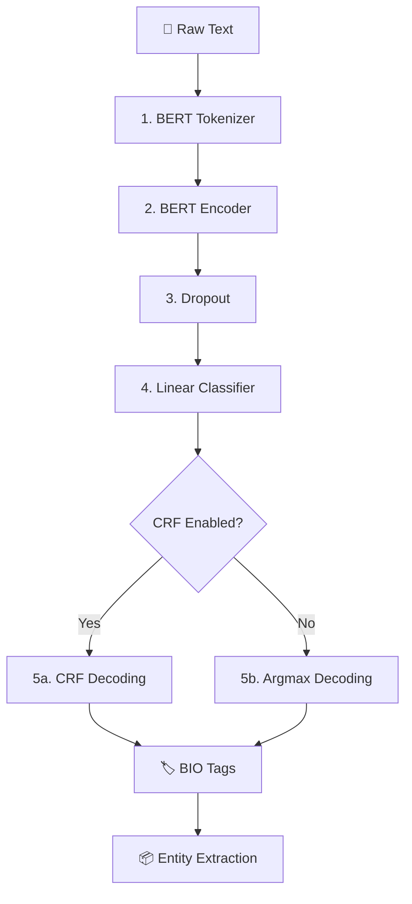

# 🏷️ Named Entity Recognition System

### BERT + CRF based Named Entity Recognition for extracting **People, Organizations, Locations & Miscellaneous Entities**

<p align="center">


<br>


</p>

<p align="center">
  <b>A production-style NLP pipeline that combines contextual BERT representations with structured CRF decoding for accurate BIO-tagged entity extraction.</b>
</p>

---

## 📑 Table of Contents

* [✨ Overview](#-overview)
* [🎥 Demo](#-demo)
* [🧠 How It Works](#-how-it-works)
* [🏗️ Architecture](#️-architecture)
* [🏷️ Entity Types](#️-entity-types)
* [🚀 Features](#-features)
* [📂 Project Structure](#-project-structure)
* [🛠️ Installation](#️-installation)
* [🏋️ Training](#️-training)
* [🔮 Inference](#-inference)
* [🖥️ Streamlit Dashboard](#️-streamlit-dashboard)
* [📊 Evaluation](#-evaluation)
* [⚙️ Configuration](#️-configuration)
* [📈 Training Pipeline](#-training-pipeline)
* [🧪 Example](#-example)
* [🗺️ Roadmap](#️-roadmap)
* [🤝 Contributing](#-contributing)
* [📄 License](#-license)
* [👤 Author](#-author)

---

# ✨ Overview

**Named Entity Recognition (NER)** is an NLP task that identifies and classifies meaningful entities within text.

This project implements a **BERT-based NER engine** fine-tuned on the **CoNLL-2003** dataset.

The model processes raw text and identifies four major entity categories:

| Entity |   Tag  | Description            |
| :----: | :----: | ---------------------- |
|   👤   |  `PER` | Person                 |
|   🏢   |  `ORG` | Organization           |
|   📍   |  `LOC` | Location               |
|   🌐   | `MISC` | Miscellaneous entities |

Unlike a simple token-level classifier, this implementation optionally uses a **Conditional Random Field (CRF)** layer to model dependencies between consecutive BIO tags.

This helps produce structurally valid entity sequences such as:

```text
B-PER → I-PER → I-PER
```

instead of invalid transitions such as:

```text
I-PER → B-LOC → I-PER
```

---

# 🎥 Demo

## Interactive NER Dashboard

> 🚧 **Demo video coming soon**

<!-- Replace the placeholder below with your uploaded demo GIF/video -->

<p align="center">


</p>

### Example

**Input**

```text
Anderson Cooper reported from New York on CNN.
```

**Output**

```text
Anderson Cooper → PER
New York         → LOC
CNN              → ORG
```

The Streamlit interface also displays:

* 🎯 Detected entity
* 🏷️ Entity type
* 📊 Confidence score
* 🔎 Inline highlighting
* 📋 Structured results table

---

# 🧠 How It Works

The complete pipeline follows:

```text
                    RAW TEXT
                       │
                       ▼
              ┌─────────────────┐
              │ BERT Tokenizer  │
              └────────┬────────┘
                       │
                       ▼
              ┌─────────────────┐
              │   BERT Encoder  │
              │  768-dim hidden │
              │    states       │
              └────────┬────────┘
                       │
                       ▼
              ┌─────────────────┐
              │     Dropout     │
              └────────┬────────┘
                       │
                       ▼
              ┌─────────────────┐
              │ Linear Classifier│
              └────────┬────────┘
                       │
                       ▼
                Token Logits
                       │
              ┌────────┴────────┐
              │                 │
              ▼                 ▼
        ┌───────────┐     ┌───────────┐
        │    CRF    │     │  Argmax   │
        │ Decoding  │     │ Decoding  │
        └─────┬─────┘     └─────┬─────┘
              │                 │
              └────────┬────────┘
                       ▼
                  BIO Tags
                       │
                       ▼
               Entity Extraction
```

---

# 🏗️ Architecture



### Model Components

| Component             | Role                                       |
| --------------------- | ------------------------------------------ |
| **BERT Tokenizer**    | Converts text into subword tokens          |
| **BERT Encoder**      | Generates contextual token representations |
| **Dropout**           | Reduces overfitting                        |
| **Linear Classifier** | Predicts BIO labels                        |
| **CRF**               | Learns valid label transitions             |
| **BIO Decoder**       | Converts predictions into entities         |

---

# 🏷️ Entity Types

The model uses the standard CoNLL-2003 entity categories.

| BIO Tag  | Meaning                           | Example  |
| -------- | --------------------------------- | -------- |
| `B-PER`  | Beginning of person               | `B-PER`  |
| `I-PER`  | Inside person                     | `I-PER`  |
| `B-ORG`  | Beginning of organization         | `B-ORG`  |
| `I-ORG`  | Inside organization               | `I-ORG`  |
| `B-LOC`  | Beginning of location             | `B-LOC`  |
| `I-LOC`  | Inside location                   | `I-LOC`  |
| `B-MISC` | Beginning of miscellaneous entity | `B-MISC` |
| `I-MISC` | Inside miscellaneous entity       | `I-MISC` |
| `O`      | Outside any entity                | `O`      |

---

# 🚀 Features

### 🧠 BERT-based NLP

Fine-tunes:

```text
bert-base-uncased
```

to generate contextual representations for token-level classification.

### 🔗 CRF Structured Decoding

The optional CRF layer models relationships between neighboring labels and helps prevent invalid BIO sequences.

### 🎯 Two-Phase Fine-Tuning

The training pipeline supports discriminative fine-tuning:

```text
Phase 1
BERT Encoder → Frozen
Classifier   → Trainable

        ↓

Phase 2
BERT Encoder → Unfrozen
Classifier   → Trainable
```

This allows the classifier head to stabilize before the pretrained encoder is updated.

### 🛡️ Overfitting Controls

Configurable:

* Dropout
* Label smoothing
* Weight decay
* Gradient clipping
* Early stopping

### 📊 Entity-Level Evaluation

Uses `seqeval` to calculate:

```text
Precision
Recall
F1 Score
```

rather than relying only on token-level accuracy.

### 💻 Multiple Inference Modes

Run predictions using:

* Single text
* Text files
* Built-in demo sentences
* Interactive Streamlit dashboard

### 📈 Experiment Tracking

Training runs can generate:

```text
TensorBoard logs
JSON training history
Best model checkpoints
```

---

# 📂 Project Structure

```text
Named-Entity-Recognition-System/
│
├── 📄 README.md
├── 📄 requirements.txt
├── 📄 config.py
├── 📄 train.py
├── 📄 resume_train.py
├── 📄 predict.py
├── 📄 eval_test.py
├── 📄 app.py
│
├── 📁 src/
│   ├── 📁 data/
│   │   └── ner_dataset.py
│   │
│   ├── 📁 model/
│   │   └── broadcast_ner_model.py
│   │
│   ├── 📁 training/
│   │   └── trainer.py
│   │
│   └── 📁 inference/
│       ├── predictor.py
│       └── analytics.py
│
├── 📁 checkpoints/
│   └── best_model.pt
│
├── 📁 output/
│   └── training_history.json
│
└── 📁 runs/
    └── TensorBoard logs
```

---

# 🛠️ Installation

## 1. Clone the repository

```bash
git clone https://github.com/pritomsarma/Named-Entity-Recognition-System.git
cd Named-Entity-Recognition-System
```

## 2. Create a virtual environment

### Windows

```bash
python -m venv .venv
.venv\Scripts\activate
```

### Linux / macOS

```bash
python -m venv .venv
source .venv/bin/activate
```

## 3. Install dependencies

```bash
pip install -r requirements.txt
```

### Requirements

* Python 3.9+
* PyTorch 2.0+
* Transformers 4.30+
* Streamlit 1.30+
* seqeval
* CUDA GPU *(optional)*

---

# 🏋️ Training

## Quick Training

Train using the default configuration:

```bash
python train.py
```

The default setup uses:

```text
Dataset:       CoNLL-2003
Epochs:        4
Batch Size:    16
Max Length:    128
CRF:           Enabled
```

---

## 🔥 Recommended Training

Use two-phase discriminative fine-tuning:

```bash
python train.py \
    --fine_tune \
    --freeze_epochs 2 \
    --epochs 6
```

---

## 🛡️ Strong Regularization

For smaller training subsets:

```bash
python train.py \
    --label_smoothing 0.15 \
    --dropout 0.4 \
    --patience 4
```

---

## ⚡ GPU + Mixed Precision

```bash
python train.py \
    --device cuda \
    --amp \
    --fine_tune
```

---

## 📚 Full CoNLL-2003 Dataset

For full-scale training:

```bash
python train.py \
    --full_data \
    --epochs 10 \
    --fine_tune
```

> ⚠️ Full training can take considerably longer on CPU. A CUDA-capable GPU is recommended.

---

# 🔮 Inference

## Built-in Demo

```bash
python predict.py --demo
```

---

## Custom Text

```bash
python predict.py \
    --model_path checkpoints/best_model.pt \
    --text "Anderson Cooper reported from New York on CNN."
```

Expected conceptually:

```text
Anderson Cooper → PER
New York        → LOC
CNN             → ORG
```

---

## File-Based Inference

Create:

```text
transcripts.txt
```

with one sentence per line.

Then:

```bash
python predict.py \
    --model_path checkpoints/best_model.pt \
    --file transcripts.txt \
    --analytics \
    --output results.json
```

---

# 🖥️ Streamlit Dashboard

Launch the interactive web application:

```bash
streamlit run app.py
```

Then open the local Streamlit URL shown in your terminal.

### Dashboard capabilities

```text
┌──────────────────────────────────────────┐
│       Named Entity Recognition           │
├──────────────────────────────────────────┤
│                                          │
│  Enter text here...                      │
│                                          │
│  [       Analyze Entities       ]         │
│                                          │
├──────────────────────────────────────────┤
│                                          │
│  Highlighted Entities                    │
│                                          │
│  Entity     Type       Confidence         │
│  ─────────────────────────────────────   │
│  CNN        ORG        98.4%              │
│  New York   LOC        96.8%              │
│                                          │
└──────────────────────────────────────────┘
```

---

# 📊 Evaluation

Run evaluation on the held-out test split:

```bash
python eval_test.py
```

The evaluation pipeline uses **seqeval** for entity-level metrics.

### Metrics

| Metric        | Description                                         |
| ------------- | --------------------------------------------------- |
| **Precision** | Percentage of predicted entities that are correct   |
| **Recall**    | Percentage of actual entities successfully detected |
| **F1 Score**  | Harmonic mean of precision and recall               |

The system evaluates the complete BIO sequence rather than simply counting correctly classified tokens.

---

# ⚙️ Configuration

The project uses a centralized typed configuration system through `config.py`.

### Default Configuration

| Parameter                |             Default |
| ------------------------ | ------------------: |
| Base Model               | `bert-base-uncased` |
| Maximum Sequence Length  |               `128` |
| Dropout                  |               `0.3` |
| CRF                      |             Enabled |
| Encoder Learning Rate    |              `2e-5` |
| Classifier Learning Rate |              `5e-4` |
| Label Smoothing          |               `0.1` |
| Weight Decay             |              `0.01` |
| Batch Size               |                `16` |
| Early Stopping Patience  |                 `3` |

Most training parameters can also be overridden directly through the CLI.

---

# 📈 Training Pipeline

The project follows a structured training strategy designed to balance pretrained knowledge preservation with task-specific adaptation.

```text
             ┌─────────────────────┐
             │   Pretrained BERT    │
             └──────────┬──────────┘
                        │
                        ▼
              ┌─────────────────┐
              │ Phase 1 Training│
              │                 │
              │ Freeze BERT     │
              │ Train Classifier│
              └────────┬────────┘
                       │
                       ▼
              ┌─────────────────┐
              │ Phase 2 Training│
              │                 │
              │ Unfreeze BERT   │
              │ Lower Encoder LR│
              └────────┬────────┘
                       │
                       ▼
              ┌─────────────────┐
              │ Validation      │
              │ Precision/Recall│
              │ F1              │
              └────────┬────────┘
                       │
                       ▼
              ┌─────────────────┐
              │ Early Stopping  │
              └────────┬────────┘
                       │
                       ▼
              ┌─────────────────┐
              │ Best Checkpoint │
              │ best_model.pt   │
              └─────────────────┘
```

---

# 🧪 Example

### Input

```text
Barack Obama visited Microsoft headquarters in Seattle.
```

### Expected Entity Extraction

| Entity       | Type  |
| ------------ | ----- |
| Barack Obama | `PER` |
| Microsoft    | `ORG` |
| Seattle      | `LOC` |

### BIO Representation

```text
Barack      B-PER
Obama       I-PER
visited     O
Microsoft   B-ORG
headquarters O
in          O
Seattle     B-LOC
```

---

# 📦 Outputs

After training, the project can produce:

```text
checkpoints/
└── best_model.pt

output/
└── training_history.json

runs/
└── TensorBoard experiment logs
```

The best-performing checkpoint is selected according to validation performance.

---

# 🗺️ Roadmap

* [x] BERT-based token classification
* [x] CoNLL-2003 dataset support
* [x] BIO tagging
* [x] CRF decoding
* [x] Entity-level evaluation
* [x] Two-phase fine-tuning
* [x] Configurable training pipeline
* [x] CLI inference
* [x] Streamlit dashboard
* [x] TensorBoard logging
* [x] JSON training history

### Future Improvements

* [ ] Support multilingual NER
* [ ] Add more pretrained transformer backbones
* [ ] ONNX inference optimization
* [ ] REST API deployment
* [ ] Docker support
* [ ] Cloud deployment
* [ ] Model quantization
* [ ] Interactive confusion matrix
* [ ] Per-entity performance visualization

---

# 🤝 Contributing

Contributions, issues, suggestions, and feature requests are welcome.

### Contribution workflow

```bash
# Fork the repository

git clone https://github.com/pritomsarma/Named-Entity-Recognition-System.git

git checkout -b feature/your-feature

# Make your changes

git add .
git commit -m "Add your feature"

git push origin feature/your-feature
```

Then open a Pull Request.

---

# 📄 License

No license has currently been specified for this repository.

If you plan to distribute the project or accept external contributions, consider adding an open-source license such as **MIT**.

---

# 👤 Intern

## Pritom Sarma

**Electronics & Communication Engineering Student 

### Connect

<p align="left">

<a href="https://github.com/pritomsarma">

</a>

</p>

---

<p align="center">

**Built with Python • PyTorch • Hugging Face Transformers • BERT • CRF • Streamlit**

</p>

